<!-- the manifesto runs itself. commit console.svg next to this README. -->

  

<code>$ leonard --watch</code>
 
fine. one dashboard. it builds itself.

  

  

  

<a href="https://policycortex.com"><b>PolicyCortex</b></a> · Founder&ensp;&#124;&ensp;<a href="https://www.orbitrasecurity.com"><b>Orbitra Security</b></a> · Co-founder &amp; CTO&ensp;&#124;&ensp;<a href="https://www.linkedin.com/in/leonardesere/">LinkedIn</a>&ensp;&#124;&ensp;<a href="mailto:lesere@laeintel.com">Email</a>

the terminal cannot render links. that is the only reason this footer exists.

